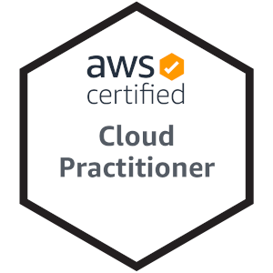

# Homepage of Hasuzawa
This is my [homepage](). This is not a collaborative project but I welcome ideas and suggestions.

The website is a single page application written with React, Sass and standard HTML,CSS,JS. This website will be deprecated within a few months and replaced by a new website written in Next.js.

For a structural overview of the website, please visit [the Wiki of this project](https://github.com/Hasuzawa/homepage/wiki/Overview).
Alternatively, utilise the [official google plugin](https://chrome.google.com/webstore/detail/react-developer-tools/fmkadmapgofadopljbjfkapdkoienihi)

The summary of the website is given below.

## Personal Background

  
unique skillset

I am a full stack developer with science background. I can programme in a variety of languages and am familiar with many popular frameworks.

I value efficiency, time and self-improvement. I am still in the stage of learning but has already
acquired sufficient skills to contribute.

I am also a polygot and can speak 4 langauges in real life. The ability to communicate with people around the world is invaluable in an increasingly globalised world.

I am open to opportunities that requires relocation.

## Work Experience

  
Full stack developer and system engineer

  Currently I am working as a full stack developer in Osaka, Japan.

  I worked on a part of intranet system that monitor subnets.
  I implemented a frontend with HTML, CSS, Javascript in the frontend as a GUI for controlling connections.
  In the backend, I programmed the logic using Java and SQL to fetch the relevant data for the frontend and to update the database in a HTTP request & response cycle.

  I have work experience with HTML, CSS, JavaScript, Java, SQL, PostgreSQL.

## Project

   
Lifetime learning

   It is recommended to go to the page of each project for a more comprehensive summary.

   -  Website with React (this project) 
      A simple website written using React framework with extensive usage of Sass.
      
   -  Django project (planned)

## Skill

  
Languages, techs and tools

  ### Programming Languages
  
  
  
  
  
  

  I am most proficient in Python, JavaScript and Java. But I know important concepts common in most programming languages
  such as loop, object-oriented, array, list, set, map, pointer, namespace. I can migrate my knowledge to any programming language.

  ### Web Development
  
  
  
  
  
  
  

  I have written my own homepage from zero. I have many planned projects, each will incorporate new skills and techniques I have acquired.

  ### Technology
  -  knowledge on networking, server, OSI model, IP address, MAC address, DNS.
  -  basic knowledge on cyber security and vulnerability including cross-site scrpting, password cracking techniques, authentication, public key crytography.

  ### Cloud Computing
  

  I know the services provided by AWS. I am learning to host my own project on AWS.

  ### Graphics
  
  

  I primarily use Gimp for raster graphics and Inkscape for vector graphics. Both are free and open-source.

  ### Languages
  -  English 
     I am bilingual in English and Chinese. I completed most of my education in English.
  -  Japanese 
     I live and work in Japan right now and has passed the highest level of the most recognised Japanese exam JLPT.
  -  German 
     I can understand daily life German and can read German news and publications.
  -  Chinese 
     I am a native speaker of Chinese.

## Contact
I can be reached via email: <a href="mailto:hasuzawa.yuichi.international@gmail.com">hasuzawa.yuichi.international@gmail.com</a>